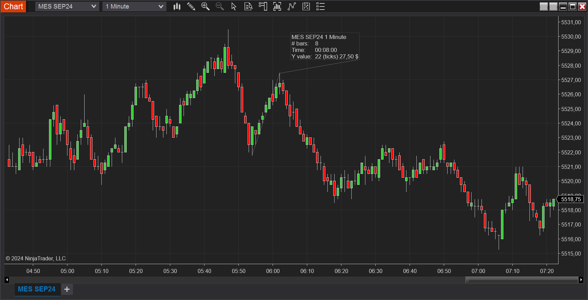

# RulerEnhanced drawing tool

NinjaTrader's default ruler shows the marked distance either in ticks, price, currency, pips, or percent. The **RulerEnhanced** allows selecting two values.

## Installation

1. Download the `RulerEnhanced.zip` file 
2. Import it in NinjaTrader: `Tools -> Import -> NinjaScript Add-On...`
3. Right click on the chart and select **Drawing Tools** -> **Ruler Enhanced**. Custom drawing tools are typically added to the bottom of the list.

